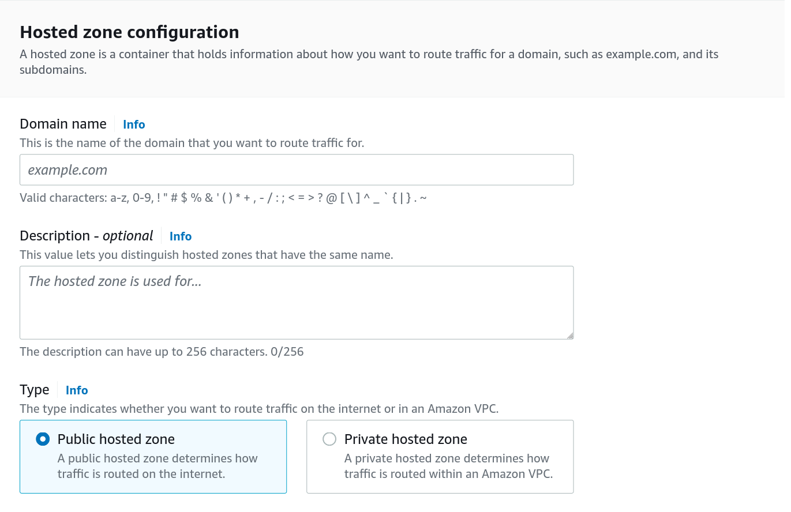
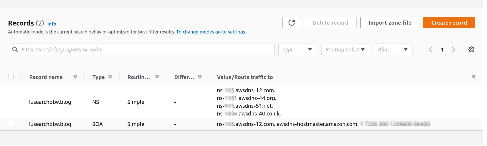
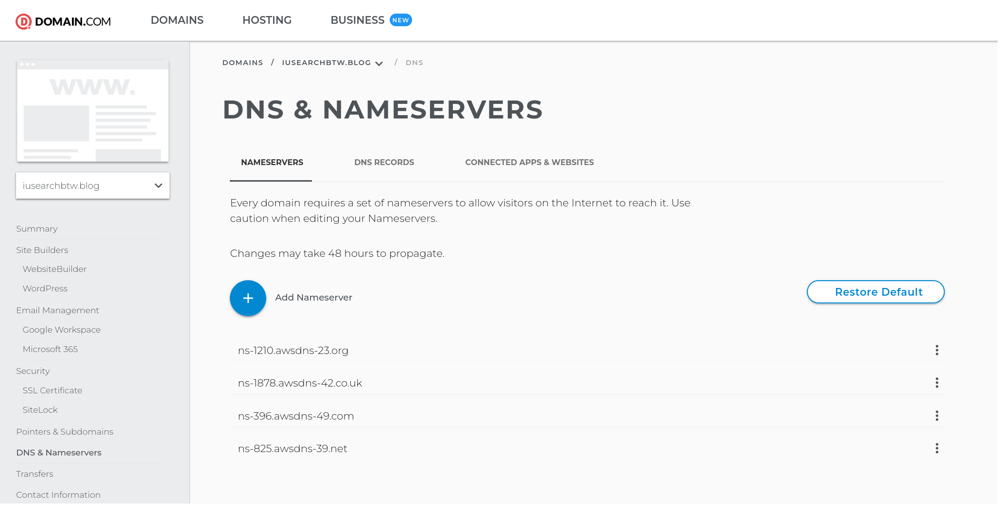

<style>
img {
    box-shadow: inset 10px 10px 60px #fff;
    -moz-border-radius:25px;
    border-radius:10px;
}
</style>

Use a more versatile DNS service than your Domain provider with AWS Route53.

<!--more-->

# Why?

Most Domain Providers do not offer a programmatic approach to updating DNS records.
If you have already purchased a domain outside AWS and you cannot transfer it but you want to control the DNS records programmatically, this article is for you

# Steps

## AWS Route 53 Preparation

First login to **AWS** and head to **Route53**.
There you will see a **Hosted Zones** section. Click on **Create Hosted Zone**.



After the Zone is created, you will see a **NS** record. This is the **Nameserver** record that you will need to update your domain provider with.

<!--insert image of NS reccords  -->



> **Note:** A hosted zone acts as a domain manager for your domain

## Domain Provider Preparation

Login to your **Domain Provider** and head to the **DNS** section.
There you will see a **Nameservers** section. Click on **Manage Nameservers**.

By default, the **Domain Provider** will have a set of nameservers for your domain.



> **Note:** A nameserver is a server that stores the DNS records for a domain, like an IP address, for example.

# How to check if it's working?

## The CLI Way

```bash
> dig ns iusearchbtw.blog

; <<>> DiG 9.18.6 <<>> ns iusearchbtw.blog
;; global options: +cmd
;; Got answer:
;; ->>HEADER<<- opcode: QUERY, status: NOERROR, id: 61482
;; flags: qr rd ra; QUERY: 1, ANSWER: 4, AUTHORITY: 0, ADDITIONAL: 1

;; OPT PSEUDOSECTION:
; EDNS: version: 0, flags:; udp: 512
;; QUESTION SECTION:
;iusearchbtw.blog.    IN  NS

;; ANSWER SECTION:
iusearchbtw.blog. 21600 IN  NS  ns-1210.awsdns-23.org.
iusearchbtw.blog. 21600 IN  NS  ns-1878.awsdns-42.co.uk.
iusearchbtw.blog. 21600 IN  NS  ns-396.awsdns-49.com.
iusearchbtw.blog. 21600 IN  NS  ns-825.awsdns-39.net.

;; Query time: 43 msec
;; SERVER: 192.168.1.107#53(192.168.1.107) (UDP)
;; WHEN: Sun Sep 11 19:55:18 BST 2022
;; MSG SIZE  rcvd: 185

```

## The Online Way

- <https://dnschecker.org/ns-lookup.php>
- <https://www.whatsmydns.net/dns-lookup/ns-records?query=iusearchbtw.blog&server=google>
- <https://mxtoolbox.com/SuperTool.aspx?action=dns%3aiusearchbtw.blog&run=toolpage>

# Risks

# Order of execution

Ensure your DNS records are set correctly before you update your nameservers.
This will ensure that your domain is not down for some time.

## DNS Propagation

While setting up new DNS records, it can take up to 24 hours for the changes to propagate. This is because DNS records are cached by your ISP and other DNS servers.
Setting a low TTL (Time To Live) can help with this.

## Static vs Dynamic websites

- On a site with static content, this is relatively easy - have the identical site on both old and new locations during the changeover period. A gotcha to be aware of is HTTPS/SSL certificates - particularly if running something like certbot you will need to ensure certificate validity on both systems during the changeover window.
- On a dynamic site, this is a LOT harder. Depending on how you handle sessions, you may be able to rig up some kind of replication or take the view that you can disconnect everyone as long as they can immediately reconnect (or some other solution). The trick here is to use a reverse proxy/load balancer. There are different ways to do this - one might be to migrate the site to a preconfigured load balancer, point the load balancer to new IP, update DNS again, and remove the load balancer. There are plenty of variations on the theme, including turning the old system into a reverse proxy for the new system in the interim.

> An important aside - if a short period of downtime for current users is OK, you can reduce TTLs in DNS to 60 seconds (lower is not a good idea) - in that way, the vast majority of users will be switched from old to a new server in a minute or 2.

# References

- <https://www.virtuallyboring.com/migrate-godaddy-domain-and-dns-to-aws-route-53/>
- <https://docs.aws.amazon.com/Route53/latest/DeveloperGuide/migrate-dns-domain-in-use.html>
- <https://docs.aws.amazon.com/Route53/latest/DeveloperGuide/MigratingDNS.html>
