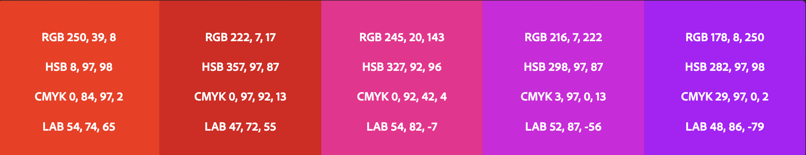
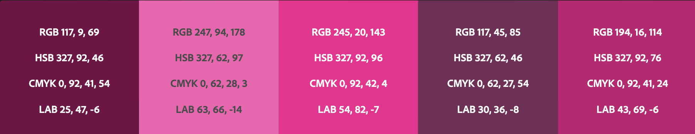
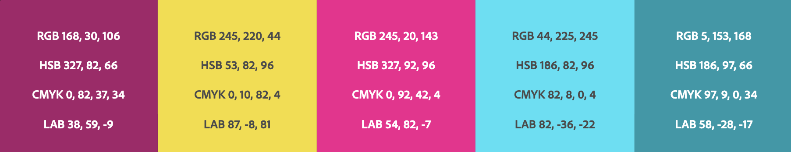
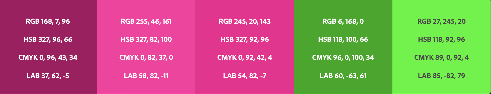
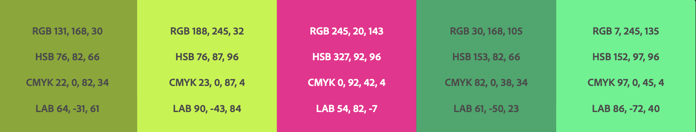
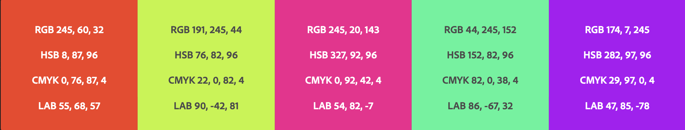
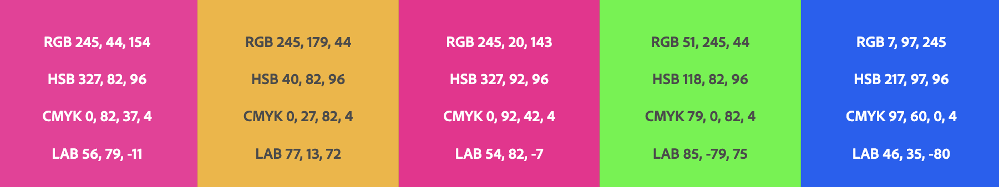
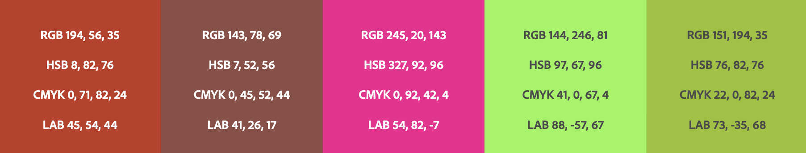
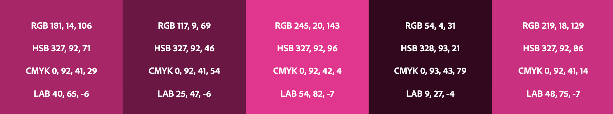

This article explores how different colour harmony rules, including analogous, monochromatic, triadic, complementary, split complementary, double split complementary, square, compound, and shades, impact design and emotions.

<!--more-->

Colour harmony rules create a sense of visual balance and unity in design. They are based on the principles of colour theory, which explores how different colours interact.

# Color Harmony Rules

## Analogous Color Harmony

Analogous colour schemes use colours adjacent to each other on the colour wheel. This creates a subtle, harmonious effect that is often found in nature. Analogous colour schemes are ideal for conveying a sense of calm and relaxation.

## Monochromatic Color Harmony

Monochromatic colour schemes use variations of a single colour. This creates a harmonious effect that is calming and visually pleasing. Monochromatic colour schemes are ideal for creating a sense of unity and simplicity.

## Triadic Color Harmony

Triadic colour schemes use colours that are evenly spaced around the colour wheel. This creates a vibrant and energetic effect often found in children's toys and games. Triadic colour schemes are ideal for creating a sense of excitement and playfulness.

## Complementary Color Harmony

Complementary colour schemes use colours opposite each other on the colour wheel. This creates a dramatic and eye-catching effect often used in advertising and marketing. Complementary colour schemes are ideal for creating a sense of contrast and impact.

## Split Complementary Color Harmony

Split complementary colour schemes use a base colour and the two colours adjacent to its complementary colour. This creates a harmonious and balanced effect that is less intense than a complementary colour scheme. Split complementary colour schemes are ideal for creating a sense of balance and contrast.

## Double Split Complementary

Color HarmonyDouble split complementary colour schemes use two base colours and their respective adjacent colours to their complementary colours. This creates a complex and balanced effect that is more visually interesting than a simple split complementary scheme. Double split complementary colour schemes are ideal for creating a sense of complexity and sophistication.

## Square Color Harmony

Square colour schemes use four evenly spaced colours around the colour wheel. This creates a bold and vibrant effect often used in fashion and interior design. Square colour schemes are ideal for creating a sense of boldness and energy.

## Compound Color Harmony

Compound colour schemes use two complementary colour pairs. This creates a complex and vibrant effect ideal for creating a sense of dynamism and movement.

## Shades Color Harmony

Shades colour schemes use a single colour with variations in lightness and darkness. This creates a subtle and calming effect often used in interior design. Shades colour schemes are ideal for creating a sense of tranquillity and relaxation.

# Decide which colour harmony rule to use

The choice of colour harmony should be based on the intended message and emotions the design tries to convey. For example, an analogous colour scheme may create a sense of calm and relaxation. In contrast, a complementary colour scheme may develop a sense of contrast and impact.

Here are some questions to ask before you make up your mind on which colour harmony rule to use:

- What emotions or moods are you trying to convey with your design? For example, are you aiming for a calm, relaxing, bold, and vibrant effect?
- What is the purpose of your design? Is it for a website, a brochure, or product packaging?
- What are the primary and secondary colours in your design?
- Are you looking for a simple or complex colour scheme?
- Do you want to use complementary or analogous colours in your design?
- Do you want to use a single colour with variations in lightness and darkness, or do you want to use multiple colours?
- Do you want to use warm colours (such as red, orange, and yellow) or cool colours (such as blue, green, and purple)?
- What is your target audience, and what colours will appeal to them?

---

Different colour harmony rules can affect one's view of a page in various ways. For example, an analogous colour scheme may create a sense of calm and relaxation. In contrast, a complementary colour scheme may create a sense of contrast and impact. The choice of colour harmony can also affect the mood and tone of a design, such as a monochromatic colour scheme creating a sense of simplicity and unity. In contrast, a triadic colour scheme can create a sense of excitement and playfulness. Ultimately, the choice of colour harmony should be based on the intended message and emotions the design tries to convey.
