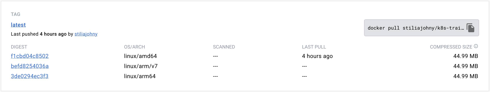

<style>
img {
    box-shadow: inset 10px 10px 60px #fff;
    -moz-border-radius:25px;
    border-radius:10px;
}
</style>

The article explains how to use Docker Buildx on a MacBook M2 to build and push multi-architecture Docker images, with relevant tags included.

<!--more-->

## Introduction

Building Docker images that work on multiple platforms can be challenging, especially on non-x86 architectures like the MacBook M2. Fortunately, Docker Buildx simplifies the process of building and pushing multi-architecture Docker images, allowing developers to create cross-platform containers with ease. In this article, I'll show you how to use Docker Buildx to build and push multi-architecture Docker images on a MacBook M2, so you can develop for ARM, x86, and other platforms without breaking a sweat.

## Prerequisites

- A MacBook M2 or other non-x86 machine running macOS 11.3 or later.
- Docker Desktop for Mac version 3.3.0 or later installed on your machine. You can download Docker Desktop for Mac from the Docker website.
- Docker Buildx plugin installed on your machine. To install Docker Buildx, open a terminal window and run the following command:

  ```bash
  docker buildx install
  ```

- Basic knowledge of Docker and Dockerfile syntax. If you're new to Docker, you may want to check out the Docker documentation for an introduction to containers and images.

By the end of this article, you should have a basic understanding of how Docker Buildx works and how to use it to build and push multi-architecture Docker images on a MacBook M2.

## Understanding Docker Buildx

Understanding Docker Buildx
Docker Buildx is a Docker CLI plugin that extends the functionality of the Docker build command to support multiple platforms and architectures. With Docker Buildx, you can build Docker images for different CPU architectures and operating systems using a single command.

One of the key features of Docker Buildx is its ability to use a build kit to generate platform-specific artifacts that can be used to build multi-architecture images. A build kit is a collection of tools and configuration files that are used to build a Docker image. When you use Docker Buildx to build an image, it creates a build kit for each platform and architecture you specify, then uses these build kits to create the final image.

Docker Buildx supports a variety of build platforms, including **ARMv7**, **ARM64**, **x86**, and **PowerPC**. You can specify one or more platforms using the --platform option when you run the docker buildx build command. This option tells Docker Buildx which platforms to build the image for, and generates a platform-specific build kit for each platform.

Docker Buildx also supports the creation of multi-platform Docker manifest lists, which allow you to create a single image that includes platform-specific layers for each platform. This makes it easy to distribute your Docker images to a variety of platforms, without having to maintain separate images for each platform.

In the next section, I'll show you how to create a multi-architecture Dockerfile that can be used with Docker Buildx to build images for different platforms.

## Creating a Multi-Architecture Dockerfile

To build multi-architecture Docker images with Docker Buildx, you need to start by creating a Dockerfile that can be built for different platforms. One way to do this is by using platform-specific FROM statements to specify the base image for each architecture.

Here are teo examples Dockerfile that uses platform-specific FROM statements to build an image for ARMv7, ARM64, and x86 architectures:

### Multi FROM build stages

```Dockerfile
# Dockerfile

# Base image for ARMv7 architecture
FROM arm32v7/node:14-alpine AS armv7

# Base image for ARM64 architecture
FROM arm64v8/node:14-alpine AS arm64

# Base image for x86 architecture
FROM node:14-alpine AS x86

# Common image configuration
WORKDIR /app
COPY . .

# Build for ARMv7 architecture
FROM armv7 AS build-armv7
RUN npm install && npm run build-armv7

# Build for ARM64 architecture
FROM arm64 AS build-arm64
RUN npm install && npm run build-arm64

# Build for x86 architecture
FROM x86 AS build-x86
RUN npm install && npm run build-x86

# Create the final multi-architecture image
FROM --platform=$BUILDPLATFORM armv7 AS final
COPY --from=build-armv7 /app/dist /app/dist
COPY --from=build-arm64 /app/dist /app/dist
COPY --from=build-x86 /app/dist /app/dist


WORKDIR /app

COPY package*.json ./
RUN npm install

COPY . .

EXPOSE 3000

CMD ["npm", "start"]

```

In this example, we start by specifying three different base images: arm32v7/node:14-alpine for ARMv7, arm64v8/node:14-alpine for ARM64, and node:14-alpine for x86. We then define a common image configuration that copies the application files into the image.

Next, we create separate build stages for each architecture, using the appropriate FROM statement for each platform. In each build stage, we run the necessary build commands to generate the platform-specific artifacts.

Finally, we create a final image that uses the --platform option to specify the target platform, and copies the appropriate artifacts from each build stage into the final image.

In the next section, we'll show you how to use Docker Buildx to build this Dockerfile for different platforms.

### Single FROM statement

When you use a single FROM statement with the --platform option, you're telling Docker Buildx to generate a platform-specific build kit for the specified platform. This build kit contains the necessary files and configuration to build the Docker image for the specified platform.

For example, let's say you want to build a Docker image for both ARMv7 and x86 architectures. You could use a single FROM statement with the --platform option like this:

```dockerfile

FROM --platform=$BUILDPLATFORM  node:14-alpine

WORKDIR /app

COPY package*.json ./
RUN npm install

COPY . .

EXPOSE 3000

CMD ["npm", "start"]
```

## Building Multi-Architecture Images with Buildx

Once you've created a multi-architecture Dockerfile, you can use Docker Buildx to build the Docker image for different platforms. To do this, you'll need to create a Docker Buildx builder instance and use it to run the docker buildx build command.

Here's an example command to build a Docker image for ARMv7, ARM64, and x86 architectures using a Dockerfile named Dockerfile:

```bash
docker buildx build --platform linux/arm/v7,linux/arm64,linux/amd64 -t myimage:latest .

```

In this example, we're using the --platform option to specify the platforms we want to build the Docker image for. We're also using the -t option to tag the image with the name myimage and the . at the end to specify the build context.

When you run this command, Docker Buildx will generate platform-specific build kits for each platform and use them to build the Docker image. Once the build process is complete, you'll have a multi-architecture Docker image that can run on ARMv7, ARM64, and x86 architectures.

## Pushing Multi-Architecture Images to a Registry



Once you've built a multi-architecture Docker image, you can push it to a Docker registry so that others can download and use it. To push a multi-architecture Docker image to a registry, you'll need to create a Docker Buildx builder instance and use it to run the docker buildx push command.

Here's an example command to push a Docker image named myimage to a Docker registry:

```bash
docker buildx push --platform linux/arm/v7,linux/arm64,linux/amd64 myregistry/myimage:latest
```

In this example, we're using the --platform option to specify the platforms we want to push the Docker image for. We're also using the myregistry/myimage:latest syntax to specify the name and tag of the Docker image we want to push.

When you run this command, Docker Buildx will push the Docker image to the specified registry, making it available for others to download and use on ARMv7, ARM64, and x86 architectures.

In the next section, I'll show you how to verify that your Docker image and registry support multiple architectures.

## Verifying the Image and Architecture Support

After building and pushing a multi-architecture Docker image, it's important to verify that the image and the registry support multiple architectures. This can help ensure that your Docker image will run correctly on the platforms you're targeting and can be easily distributed to others.

To verify the image and architecture support of a Docker image, you can use the docker manifest inspect command. This command allows you to inspect the manifest list for a Docker image, which contains information about the platforms and layers included in the image.

Here's an example command to inspect the manifest list for a Docker image named myimage:

```bash
docker manifest inspect myregistry/myimage:latest
```

When you run this command, Docker will display a JSON document that includes information about the platforms and layers included in the Docker image. You can use this information to verify that the image includes the platforms you're targeting and that the layers are correctly configured for each platform.

To verify the architecture support of a Docker registry, you can use the docker manifest inspect command with the --insecure option. This option allows you to inspect the manifest list for a Docker image without verifying the registry's TLS certificate.

Here's an example command to inspect the manifest list for a Docker image on a registry named myregistry using the --insecure option:

```bash
docker manifest inspect --insecure myregistry/myimage:latest
```

When you run this command, Docker will display the same JSON document as before, indicating that the registry supports multiple architectures.

By verifying the image and architecture support of a Docker image and registry, you can ensure that your multi-architecture Docker images will run correctly on the platforms you're targeting and can be easily distributed to others.

## Conclusion

Building multi-architecture Docker images with Docker Buildx is a powerful way to ensure that your Docker images can run on a variety of platforms and architectures. By using a multi-architecture Dockerfile and the --platform option with Docker Buildx, you can easily build Docker images for ARMv7, ARM64, x86, and other architectures using a single command.

In this article, we've shown you how to create a multi-architecture Dockerfile, build multi-architecture Docker images with Docker Buildx, push the images to a Docker registry, and verify that the images and registry support multiple architectures. By following these steps, you can ensure that your Docker images are easily distributable and can run correctly on a variety of platforms.

We hope this article has been helpful in understanding how to build multi-architecture Docker images with Docker Buildx on a MacBook M2 or other non-x86 machine running macOS 11.3 or later. If you have any questions or feedback, please let us know in the comments section below.

## References

- <https://www.docker.com/blog/multi-arch-build-and-images-the-simple-way/>
- <https://www.thorsten-hans.com/how-to-build-multi-arch-docker-images-with-ease/>
- <https://levelup.gitconnected.com/build-multi-arch-docker-images-ef8b3c859a1e>
- <https://dev.to/cvitaa11/building-multi-architecture-docker-images-2e9k>
- <https://dev.to/aws-builders/using-docker-manifest-to-create-multi-arch-images-on-aws-graviton-processors-1320>
- <https://cloud.google.com/kubernetes-engine/docs/how-to/build-multi-arch-for-arm>
- <https://www.youtube.com/watch?v=xa-puqZEhjc>
- <https://www.youtube.com/watch?v=hWSHtHasJUI>
- <https://www.youtube.com/watch?v=G6wCo1WBPTo>

## TL:DR

To build multi-architecture Docker images with Docker Buildx, you can use a single Dockerfile with platform-specific `FROM` statements or a single `FROM` statement with the `--platform` option. Use the `docker buildx build` and `docker buildx push` commands with the `--platform` option to build and push multi-architecture Docker images. Finally, verify image and architecture support using the `docker manifest inspect` command. By following these steps, you can ensure that your Docker images are easily distributable and can run correctly on a variety of platforms.
