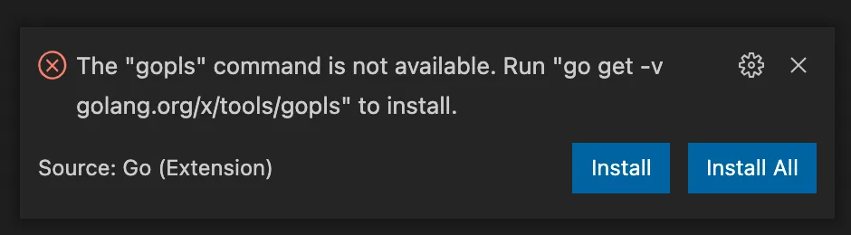

<style>
img {
    box-shadow: inset 1px 1px 6px #fff;
    -moz-border-radius:25px;
    border-radius:10px;
}
</style>

Monday in France Installing Go on MacOS.

<!--more-->

Are you ready to dive into the world of Go? With its unique combination of speed, reliability, and simplicity, Go is quickly becoming one of the most popular programming languages out there. In this article, we'll walk you through the process of installing Go on your MacBook, and show you how to set up a simple example project using Go modules. We'll even give you some tips on how to configure Visual Studio Code for Go development, so you can start coding with confidence. So what are you waiting for? Let's get started and explore the power of Go!

# Prerequisites

To follow along with this article, you need to have Homebrew installed. You can find the installation instructions on the [official website.](https://brew.sh/)

# Installing Go

A few years ago installing Go was a painful experience as you had to create a specific folder structure to make sure the dependency management would work correctly. I also remember having to fiddle around with things like `GOPATH`.

Nowadays all you need to do is execute the command:

```bash
brew install go
```

At the time of writing, this command installs Go version `1.16`. Afterward, you can verify the installation via `go version` which should yield a response like:

```bash
go version
go version go1.20 darwin/arm64
```

# Example project

With Go installed, it’s time to create a simple example project.

## Create a new project

Let’s start by creating a directory for our project:

```bash
mkdir example
cd example
```

In Go, dependency management is done through the `go.mod` file which can be created using the `go mod init` [command](https://golang.org/ref/mod#go-mod-init) followed by the module's name, typically the repository where the code is stored (e.g. `github.com/<GITHUB_USERNAME>/example`).

For now, we will just use `example.com/example`:

```bash
go mod init example.com/example
```

Once you run the `go mod init` command in the example directory, a `go.mod` file will be created that describes the module's properties, including its dependencies on other modules.

To further develop the project, you can create a `main.go` file in the same directory and include a "hello world" example.

```go
package main

import "fmt"

func main() {
    fmt.Println("Hello, Hugo!")
}
```

To execute the code, we can use the go run command followed by the name of the Go file, like this:

```go
go run main.go
```

This will compile and run the program, and you should see the output "Hello, Medium!" printed to the console.

# External modules

Instead of using the default `fmt.Println()` to print our message, we might want to use a real logger. One popular logging package for Go is `logrus`. Since it's not part of the standard library, we need to use Go modules to import it into our project.

To get started, we can update the code in main.go to:

```go
package main

import log "github.com/sirupsen/logrus"

func main() {
	log.Info("Just an INFO log, no worries")
	log.Warn("A WARN log might make us a bit nervous...")
	log.Error("Now something is really wrong!")
}
```

To add the `logrus` module to our project, we need to update our `go.mod` file. We can use the `go mod tidy` command to automatically add the module and update our dependencies. This command will also create a `go.sum` file for module authentication purposes.

```bash
go mod tidy
```

If you run the code again, it should display three log messages.

```bash
go run .
INFO[0000] Just an INFO log, no worries
WARN[0000] A WARN log might make us a bit nervous...
ERRO[0000] Now something is really wrong!
```

# Visual Studio Code

When it comes to IDEs for Go development, two popular options are [GoLand](https://www.jetbrains.com/go/) from JetBrains and [Visual Studio Code](https://code.visualstudio.com/) from Microsoft. While GoLand offers more advanced features, it comes with a price tag, making it less suitable for hobby projects. Therefore, I chose to use Visual Studio Code for this project.

Homebrew makes installing Visual Studio Code easy:

```bash
brew install --cask visual-studio-code
```

# Go extension

To take full advantage of features like IntelliSense and code navigation in Visual Studio Code for Go development, you need to install the [Go for Visual Studio Code](https://marketplace.visualstudio.com/items?itemName=golang.go) extension.

To do this, open Visual Studio Code, navigate to `Code > Preferences > Extensions` and search for the extension. Once installed, if any required command-line tools are missing, a pop-up will appear the first time you open a directory or workspace with Go code. Simply click "Install All" to install the missing tools.

The extension depends on some extra command-line tools. If they are missing you get to see a pop-up, the first time you open a directory or workspace which contains Go code. Click `Install All`.



# Enable autosave

With the default settings, Visual Studio Code requires a manual action to save the file you are working on. Unsaved changes have left me puzzled many times during local testing. I always enable auto-saving for Visual Studio Code. You can enable auto-saving via `File > Auto Save`.

# Conclusion

The installation process for Go and setting up a workspace has become much simpler compared to a few years ago, eliminating the need for complicated and error-prone folder structures.

In my experience with Go modules, I've found dependency management to be straightforward and reliable, giving me confidence in starting a new hobby project with the language.

The Go extension for Visual Studio Code is a great tool for Go development, providing features such as IntelliSense and code navigation. As a user of JetBrains IDEs for Java development, I may consider switching to GoLand for future Go programming ;).
