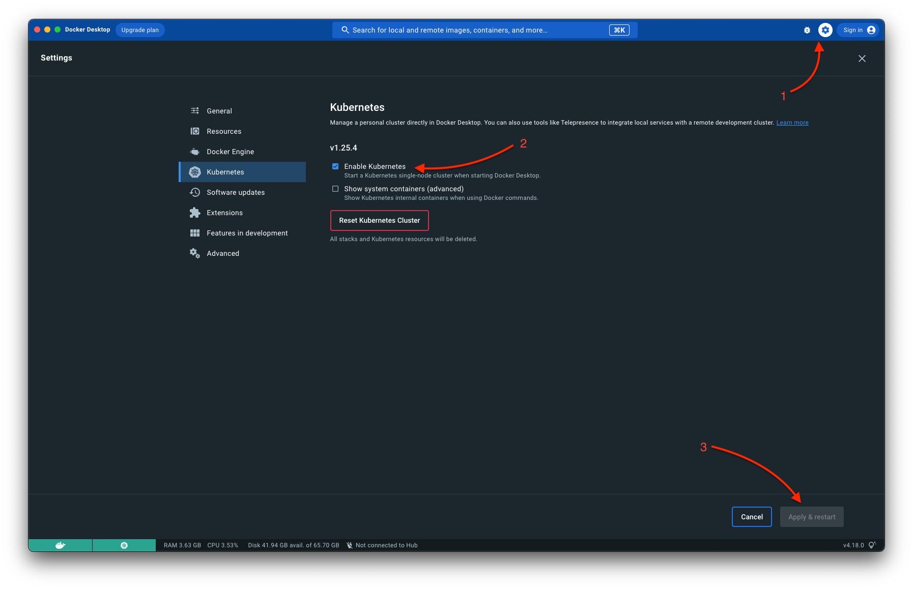
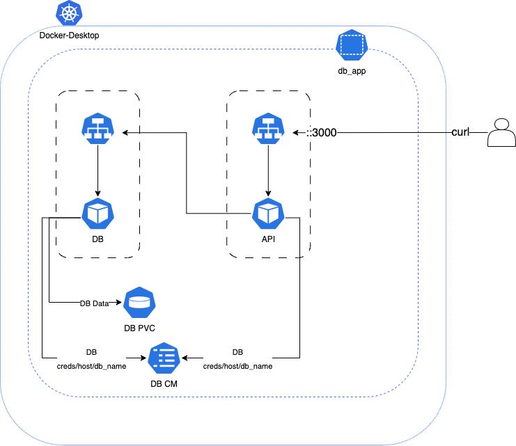

<style>
img {
    box-shadow: inset 10px 10px 60px #fff;
    -moz-border-radius:25px;
    border-radius:10px;
}

</style>

Embark on a captivating, example-driven journey to master the art of linking web apps and databases using Kubernetes, guided by yours truly.

<!--more-->


In the following tutorial, some but not all best practices are followed.
This is intentional to enable individuals to understand the concepts and the process of connecting a web application to a database using Kubernetes.
For more information on best practices, please refer to the official documentation. or use Chat GPT ;)




# Introduction

So, fasten your seatbelts and get ready for an exhilarating ride into the world of web apps, databases, and Kubernetes! In today's ever-evolving tech landscape, connecting web applications to databases has become a fundamental aspect of modern software development. Kubernetes, a powerful container orchestration platform, offers an elegant way to manage this connection and ensure smooth, reliable operation. In this article, we'll delve into the fascinating world of Kubernetes, revealing how you can effortlessly establish a connection between your web app and a database using Deployments, Services, and ConfigMaps. Together, we'll navigate through step-by-step examples that will leave you confident in your newfound skills and ready to tackle your next Kubernetes-based project.

# Introduction to Kubernetes and Its Components

Kubernetes, is a robust platform that conjures order amidst the chaos of containerized applications. It conjures a spellbinding array of features, such as Deployments, Services, and ConfigMaps, all working together in a choreographed performance to make your applications run smoothly and reliably. In the delightful world of Kubernetes, where container orchestration becomes a whimsical experience, our journey begins with an introduction to its fundamental components.

So, let's don our explorer's hat and embark on a thrilling adventure to unravel the mysteries of Kubernetes and its enchanting components!

# Setting Up Your Environment

Honestly, there is plenty of ways to configure Kubernetes.

It depends on your local development environment (as of the OS) and the cloud provider you are using.
For the purpose of this article, we will use Docker Desktop for Mac; however, the process will be the SAME for Minikube, Docker Desktop for Windows, and Docker Desktop for Linux, EKS, Native K8s, etc.

The great benefit that Kubernetes has is that it is a portable platform. You can run it on your local machine, a cloud provider, or a Raspberry Pi. In this article, we will use Docker Desktop for Mac, a great way to get started with Kubernetes. If you use Docker Desktop for Mac, you can skip this section.

## Download and install Docker Desktop for Mac

- Visit the Docker Desktop for Mac [download page](https://docs.docker.com/desktop/install/mac-install/) and download the latest version of Docker Desktop for Mac. Once the download is complete, open the downloaded file and follow the installation instructions.
- Enable Kubernetes on the Docker Desktop for Mac application. To do this, open the Docker Desktop for Mac application and go to Preferences > Kubernetes. Check the Enable Kubernetes checkbox and click Apply & Restart.



After this, you can see the Kubernetes cluster is running; you can use the `kubectl` command to interact with the cluster.

## Install kubectl

Kubectl is the command line tool for interacting with Kubernetes. You can use kubectl to deploy applications, inspect and manage cluster resources, and view logs. To install kubectl, run the following command:

```bash
brew install kubectl
```

# The architecture of the application

The architecture of our application comprises a MySQL database and a Node.js API, both deployed within a Kubernetes cluster. The MySQL database is managed by a Deployment named "mysql-deployment", which uses a PersistentVolumeClaim called "mysql-pvc" to ensure data persistence. A ClusterIP Service named "mysql-service" exposes the MySQL container on port 3306 **within** the cluster. Additionally, a ConfigMap called "mysql-configmap" stores database configuration information such as host, port, user, password, and database name, which other components within the system leverage.

> The configmap is not the best way to store sensitive information, but it is a good way to store information that is not sensitive and that you want to be able to modify quickly. For the purpose of the tutorial, we will use it.

On the other side of the architecture, we have the Node.js API. It is deployed using a Deployment called "api-deployment" with a replica of 4 for the Node.js container. This container connects to the MySQL database using environment variables fetched from the "mysql-configmap" ConfigMap. To expose the API and make it accessible publicly, a LoadBalancer Service named "api-service" is used, which exposes the Node.js container on port 3000.

This setup creates a well-structured and scalable architecture that allows for efficient communication between the Node.js API and the MySQL database while maintaining the flexibility to modify the configuration easily.



# Creating Kubernetes Deployments and API Code

We will be creating a range of files which you can also download from the link at the top of the page.
Those files are:

- API Code:

  - app.js: JavaScript API code
  - Dockerfile: Dockerfile for the API

- Kubernetes Files:

  - API
    - API Deployment: `api-deployment.yaml`
    - API Service: `api-service.yaml`
  - MySQL
    - MySQL Deployment: `mysql-deployment.yaml`
    - MySQL Service: `mysql-service.yaml`
    - MySQL ConfigMap: `mysql-configmap.yaml`
    - MySQL PersistentVolumeClaim: `mysql-pvc.yaml`

- Other

  - Postman Collection: `postman_collection.json`
  - OpenAPI Specification YAML: `swagger.yaml`
  - OpenAPI Specification HTML: `swagger.html`

## Create the API

### Install dependencies

We will be using Node.JS to create the API. If you don't have Node.JS installed, you can download it from [here](https://nodejs.org/en/download/).
You could use any other language to create the API; however, the process will be the same.

### Create the Node.JS project

1. Initialize the project by running the following command:

```bash
npm init -y
```

That will create a `package.json` file.

2. Install the required dependencies:

```bash
npm install express mysql2 body-parser morgan
```

That will install the following dependencies:

- `express`: A web framework for Node.JS
- `mysql2`: A MySQL client for Node.JS
- `body-parser`: A Node.JS body parsing middleware
- `morgan`: A HTTP request logger middleware for Node.JS

1. Update the `package.json` with the following scripts:

```json
"scripts": {
    "start": "node app.js",
    "dev": "nodemon app.js"
},
```

That will allow running the script localy using `npm run dev` and on the cluster using `npm start`.

4. Create a new file called `app.js` inside it. Copy the following code into the `app.js` file:

```javascript
const express = require('express');
const mysql = require('mysql2/promise');
const bodyParser = require('body-parser');
const morgan = require('morgan');

const app = express();
app.use(bodyParser.json());
app.use(morgan('combined'));

const dbConfig = {
  host: process.env.MYSQL_HOST || 'localhost',
  user: process.env.MYSQL_USER || 'root',
  password: process.env.MYSQL_PASSWORD || 'your_root_password',
  database: process.env.MYSQL_DATABASE || 'your_database_name',
};

async function createTableIfNeeded(connection) {
  const createTableSql = `
        CREATE TABLE IF NOT EXISTS messages (
            id INT AUTO_INCREMENT PRIMARY KEY,
            message VARCHAR(255) NOT NULL
        )
    `;
  await connection.query(createTableSql);
}

async function connectToDatabase() {
  try {
    const connection = await mysql.createConnection(dbConfig);
    console.log('Connected to the MySQL database.');
    await createTableIfNeeded(connection);
    console.log('Ensured that the messages table exists.');
    return connection;
  } catch (error) {
    console.error('Error connecting to the MySQL database:', error);
    return null;
  }
}

app.get('/api/messages', async (req, res) => {
  const connection = await connectToDatabase();
  if (!connection) {
    res.status(500).json({ error: 'Error connecting to the database' });
    return;
  }

  try {
    const [rows] = await connection.query('SELECT * FROM messages');
    res.json(rows);
  } catch (error) {
    res.status(500).json({ error: 'Error fetching messages' });
  } finally {
    connection.end();
  }
});

app.post('/api/messages', async (req, res) => {
  const connection = await connectToDatabase();
  if (!connection) {
    res.status(500).json({ error: 'Error connecting to the database' });
    return;
  }

  try {
    const message = req.body.message;
    if (!message) {
      res.status(400).json({ error: 'Message is required' });
      return;
    }

    const [result] = await connection.execute('INSERT INTO messages (message) VALUES (?)', [message]);
    res.status(201).json({ message: 'Message added successfully' });
  } catch (error) {
    res.status(500).json({ error: 'Error adding message' });
  } finally {
    connection.end();
  }
});

const PORT = process.env.PORT || 3000;
app.listen(PORT, () => {
  console.log(`Server is running on port ${PORT}`);
});
```


The credentials on the JavaScript file are generic for the purpose of the tutorial. You should change them to match your MySQL database credentials if this is a production application.


#### Quickly explaining the code

This is a Node.js application that creates a REST API to retrieve and add messages to a MySQL database. The app imports the express, mysql, body-parser, and morgan packages, and defines two endpoints:

GET /api/messages retrieve all messages from the database.
POST /api/messages add a new message to the database.
The app starts listening on a specified port or the default port 3000. If an error occurs while connecting to the database or executing the queries, the server responds with an appropriate error message.

> Get the API Spec from the download link at the top of the page.

### Create the Dockerfile

Create a new file called `Dockerfile` and copy the following code into it:

```dockerfile
FROM node:14-alpine

WORKDIR /app

COPY package*.json ./
RUN npm install

COPY . .

EXPOSE 3000

CMD ["npm", "start"]
```

### Build the Docker Image

1. Build the Docker image by running the following command:

```bash
docker build -t local_development/k8s_tutorial:v1 .

```

Docker will build the image and tag it with `local_development/k8s_tutorial:v1`. You can change the tag to whatever you want.


As it stands, the API will not be able to connect to the MySQL database as its missing a declaration of database connection details. We will fix that in the next section.


## Creating a MySQL Database Deployment

As we venture further into our Kubernetes journey, we arrive at the MySQL Database Deployment stage. Here, we harness the power of Kubernetes Deployments to create and manage a MySQL container, providing a stable and secure environment for our data. With careful attention to detail, we'll craft a YAML configuration that brings our MySQL container to life, defining its essential settings in the process. So, buckle up, and let's explore the exciting realm of MySQL Database Deployment, where data and containers come together in perfect harmony!

The MySQL Database deployment will have the following components:

- A Deployment: This will create the MySQL container and manage it.
- A Service: This will expose the MySQL container to the outside world( or just the k8s space only).
- A ConfigMap: This will hold the database credentials and other config.
- A PersistentVolumeClaim: This will hold the database data.

### Writing the Deployment Configuration

Create a file named `mysql-deployment.yaml` and add the following YAML configuration:

```yaml
apiVersion: apps/v1
kind: Deployment
metadata:
  name: mysql-deployment
spec:
  selector:
    matchLabels:
      app: mysql
  replicas: 1
  template:
    metadata:
      labels:
        app: mysql
    spec:
      containers:
        - name: mysql
          image: mysql:latest
          env:
            - name: MYSQL_ROOT_PASSWORD
              value: your_root_password
            - name: MYSQL_DATABASE
              value: your_database_name
            - name: MYSQL_USER
              value: your_database_user
            - name: MYSQL_PASSWORD
              value: your_database_user_password
          ports:
            - containerPort: 3306
          volumeMounts:
            - name: mysql-persistent-storage
              mountPath: /var/lib/mysql
      volumes:
        - name: mysql-persistent-storage
          persistentVolumeClaim:
            claimName: mysql-pv-claim
```

As you begin your Kubernetes journey, here are some quick and easy-to-understand comments on the MySQL Kubernetes YAML configuration:

- `apiVersion`, kind, and metadata: These fields define the basics of the Kubernetes resource. In our case, we're creating a Deployment.
- `spec`: This section is where we specify the desired state of our MySQL Deployment, such as the number of replicas and the template for creating Pods.
- `selector`: The matchLabels field tells Kubernetes how to find the Pods created by this Deployment.
- `replicas`: This field sets the desired number of Pods (instances) for our MySQL container.
- `template`: This section defines the Pod template, including metadata (labels) and the actual container specifications (e.g., image, environment variables, and ports).
- `containers`: An array that defines the containers to be deployed within the Pod. In our case, we're only deploying a single MySQL container.
- `env`: A list of environment variables that the container will use. For MySQL, we're setting the root password, database name, user, and user password.
- `ports`: This section defines the container ports that should be exposed, like the default MySQL port (3306).
- `volumeMounts` and `volumes`: These fields define how to mount a Persistent Volume Claim (PVC) to store the MySQL data, ensuring it persists even when the container restarts.
  This high-level overview should help you grasp the essential concepts of a Kubernetes YAML configuration without diving too deep into the details.

Applying the Configuration

Now that we've written our MySQL Deployment configuration, we can apply it to our Kubernetes cluster. To do this, run the following command:

```bash
$ kubectl apply -f mysql-deployment.yaml
deployment.apps/mysql-deployment created
```

Confirm the deployment was successful by running the following command:

```bash
$ kubectl get deployments -w
NAME                   READY   UP-TO-DATE   AVAILABLE   AGE
mysql-deployment       0/1     1            0           38s
```

We can see that the deployment is in progress, and the number of available replicas is 0. This is because the deployment is still in progress. Once the deployment is complete, the number of available replicas will be 1.

> It happens to know that the deployment will not be completed as there is a small error.
> The error is that the `mysql-pv-claim` is not created yet.

We can do a quick troubleshooting by running the following command:

```bash
$ kubectl get events
LAST SEEN   TYPE      REASON              OBJECT                                   MESSAGE
105s        Warning   FailedScheduling    pod/mysql-deployment-756c49dd4b-2rrcz    0/1 nodes are available: 1 persistentvolumeclaim "mysql-pv-claim" not found. preemption: 0/1 nodes are available: 1 Preemption is not helpful for scheduling.
105s        Normal    SuccessfulCreate    replicaset/mysql-deployment-756c49dd4b   Created pod: mysql-deployment-756c49dd4b-2rrcz
105s        Normal    ScalingReplicaSet   deployment/mysql-deployment              Scaled up replica set mysql-deployment-756c49dd4b to 1
```

Lets fix that on the next section.

### Creating a Persistent Volume Claim

As we've seen, the MySQL Deployment configuration we created earlier mounts a Persistent Volume Claim (PVC) to store the MySQL data. In this section, we'll create the PVC and apply it to our Kubernetes cluster.

A PVC is a request for storage by a user. It is similar to a Pod. Pods consume node resources and PVCs consume storage resources. Pods can request specific levels of resources (CPU and memory). Similarly, PVCs can request specific size and access modes (e.g., ReadWriteOnce, ReadOnlyMany, ReadWriteMany).

> TLDR: PVC is storage request by a user.

Create a file named `mysql-pv-claim.yaml` and add the following YAML configuration:

```yaml
apiVersion: v1
kind: PersistentVolumeClaim
metadata:
  name: mysql-pv-claim
spec:
  accessModes:
    - ReadWriteOnce
  resources:
    requests:
      storage: 1Gi
```

To apply the PVC configuration, run the following command:

```bash
$ kubectl apply -f mysql-pv-claim.yaml
persistentvolumeclaim/mysql-pv-claim created
```

### Exposing the Database with a Service

This MySQL Service configuration creates an internal connection point within your Kubernetes cluster. It's like a private phone line that only your web app and other services within the cluster can call to talk to the database. By using this Service, you're keeping your database secure and hidden from the outside world, while still enabling smooth communication between your web app and the database. Simple, safe, and efficient!

The database is only accessible to applications and services running within the same Kubernetes cluster. It won't be exposed to the public internet, ensuring better security and isolation.

#### Writing the Service Configuration

Create a file named `mysql-service.yaml` and add the following YAML configuration:

```yaml
apiVersion: v1
kind: Service
metadata:
  name: mysql-service
spec:
  selector:
    app: mysql
  ports:
    - protocol: TCP
      port: 3306
      targetPort: 3306
  type: ClusterIP # This is the default type which makes the service only accessible within the cluster
```

To apply the MySQL Service configuration, run the following command:

```bash
$ kubectl apply -f mysql-service.yaml
service/mysql-service created
```

### Storing Database Connection Information with ConfigMaps

ConfigMaps in Kubernetes stores non-confidential configuration data, separating it from container images. Using a ConfigMap for the web application's settings, like the MySQL Service name, simplifies updates and keeps the application organized. ConfigMaps enhance maintainability and adaptability, making container management more efficient.

#### Writing the ConfigMap Configuration

Create a file named `mysql-configmap.yaml` and add the following YAML configuration:

```yaml
apiVersion: v1
kind: ConfigMap
metadata:
  name: db-config
data:
  database_host: mysql-service
  database_port: '3306'
  database_user: root
  database_password: your_root_password
  database_name: your_database_name
```

To apply the ConfigMap configuration, run the following command:

```bash
$ kubectl apply -f mysql-configmap.yaml
configmap/db-config created
```

## Creating an API Deployment

### Writing the API Deployment Configuration

Create a file named `api-deployment.yaml` and add the following YAML configuration:

```yaml
---
apiVersion: apps/v1
kind: Deployment
metadata:
  name: my-api-service-deployment
spec:
  selector:
    matchLabels:
      app: my-api-service
  replicas: 4
  template:
    metadata:
      labels:
        app: my-api-service
    spec:
      containers:
        - name: my-api-service
          image: local_development/k8s_tutorial:v1
          imagePullPolicy: Never # this is for local development only, it will pull the image from your local docker registry, the image would need to be build in advance
          env:
            - name: MYSQL_HOST
              valueFrom:
                configMapKeyRef:
                  name: db-config
                  key: database_host
            - name: MYSQL_USER
              valueFrom:
                configMapKeyRef:
                  name: db-config
                  key: database_user
            - name: MYSQL_PASSWORD
              valueFrom:
                configMapKeyRef:
                  name: db-config
                  key: database_password
            - name: MYSQL_DATABASE
              valueFrom:
                configMapKeyRef:
                  name: db-config
                  key: database_name
          ports:
            - containerPort: 3000
          resources:
            limits:
              cpu: 500m
              memory: 512Mi
            requests:
              cpu: 250m
              memory: 256Mi
```

To apply the web application Deployment configuration, run the following command:

```bash
$ kubectl apply -f api-deployment.yaml
deployment.apps/webapp-deployment created
```

### Exposing the API Externally with a Service

This web application Service configuration creates an external connection point within your Kubernetes cluster. It's like a phone line that you can call from anywhere in the world to talk to your web application. By using this Service, you're making your web application accessible to the public internet(in our case, that is your localhost on your laptop), while still enabling smooth communication between your api and the database. Simple, safe, and efficient!

#### Writing the External Service Configuration

Create a file named `api-service.yaml` and add the following YAML configuration:

```yaml
---
apiVersion: v1
kind: Service
metadata:
  name: my-api-service
spec:
  selector:
    app: my-api-service
  ports:
    - protocol: TCP
      port: 3000
      targetPort: 3000
  type: LoadBalancer # This will expose the service to the outside world
```

# Testing the Complete Application

Now that we have all the components of our application deployed, we can test it out. To do this, we'll use the `kubectl port-forward` command to forward the port of the web application Service to our local machine. This will allow us to access the web application from our browser.

You can run a curl to add data and another curl to get the data from your database.

```bash
curl --silent --location --max-time 10 "127.0.0.1:3000/api/messages" --header "Content-Type: application/json" --data "{
      \"message\": \"Hello, world! \"
  }"
```

To get a message from the database, run the following command:

```bash
curl --silent --location --max-time 10 "127.0.0.1:3000/api/messages"
```

> Replace the IP address with the IP address of your Kubernetes cluster or endpoint.

To get the ip using kubectl you can use the following command:

```bash
[johnstilia:~]$ kubectl get services
NAME                                            TYPE           CLUSTER-IP       EXTERNAL-IP   PORT(S)                          AGE
my-api-service                                  LoadBalancer   10.109.149.213   localhost     3000:30930/TCP                   40h
mysql-service                                   ClusterIP      None             <none>        3306/TCP                         42h
```

In this case the IP is `10.109.149.213` and the port is `3000`

# Conclusion and Next Steps

In this tutorial, you learned how to deploy a web application to Kubernetes. You also learned how to use ConfigMaps, Services, and PersistentVolumeClaims to store configuration data and connect to a database.
Even though this is a lot of information, it is easy to start with Kubernetes. You can start with a simple application like this one and then move on to more complex applications. You can also use the Kubernetes documentation to learn more about the different components of Kubernetes.
